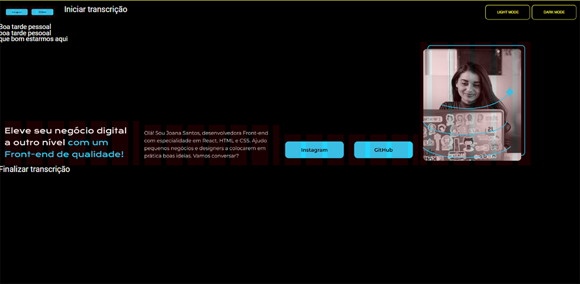

# PROJETO TESTE DE LEITOR DE LAYOUT
Este projeto faz parte de um estudo pessoal para facilitar, o entendimento de pessoas cegas o com problemas visuais, a poderem desenvolver os projetos práticos do Programa One. Esta é uma tentativa de reecriar o layout para facilitar a leitura dos leitores de telas.

  

## SOBRE O LAYOUT:
Redefinio layout para que a navegação via teclado, bem como, o leitor de tela já conseguisse ler tudo em sequencia para facilitar o entendimento do layout. 
Com isto, tentei facilitar para as pessoas com deficiência visual,(que participam do programa), pudessem entender(escutar) como desenvolver o projeto.

# NAVEGAÇÃO VIA TECLADO:
- Setas para cima e para baixo.
- Tecla TAB

# LEITOR DE TELA UTILIZADO
Versao Desktop:
NVDA - download free no site: <https://www.nvaccess.org/download/>
O Google Chrome possui várias extensões de leitura de telas. Pesquisem na parte de extensões por leitores de tela.
Como nunca usei, não tenho como indicar alguma extensão.

# OBSERVAÇÃO
Este projeto foi uma ideia inicial que tive para tentar solucionar um problema de imediato.
Com a colaboração de todos, podemos ir melhorando ou tendo novos ideias.
Esta é praticamente uma área nova para mim, pois agora que estou começando a pesquisar sobre o assunto.

